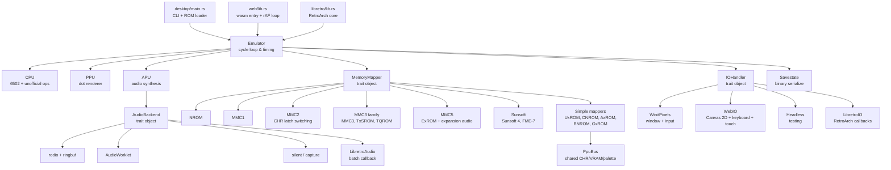

# krankulator

A cycle-stepped NES emulator written in Rust.

Started as a learning-Rust project — a bare 6502 emulator iterating against the [Klaus2m5](https://github.com/Klaus2m5/6502_65C02_functional_tests) functional test suite. NES support grew from there: naive VBlank rendering and input, validated against Kevin Horton's [nestest](http://www.qmtpro.com/~nes/misc/) log; then mapper support for real cartridges; then APU audio and cycle-accurate PPU rendering in the AI-assisted era.


## Features

- **MOS 6502 CPU** — all official opcodes plus common unofficial ones (LAX, SAX, DCP, ISB, SLO, SRE, RLA, RRA, ANC, ALR, ARR, SBX, SHA, SHX, SHY, TAS, LAS, XAA)
- **PPU** — per-dot cycle-accurate rendering, sprite evaluation, sprite 0 hit, even/odd frame timing
- **APU** — pulse, triangle, noise, and DMC channels with nonlinear NES mixing, per-cycle accumulation, and IIR high-pass/low-pass filtering at 44.1 kHz
- **Mappers** — NROM (0), MMC1 (1), UxROM (2), CNROM (3), MMC3 (4), MMC5 (5), AxROM (7), MMC2 (9), BNROM (34), Sunsoft 4 (68), Sunsoft FME-7 (69), GxROM (66), NES-EVENT (105), TxSROM (118), TQROM (119) — 695/695 licensed NTSC US games (100%)
- **Battery-backed SRAM** — persistent `.sav` files for MMC1/MMC3/MMC5 cartridges
- **Savestates** — 4 slots per game, custom binary format with full state serialization (CPU, PPU, APU including audio filter state, memory, mappers, controllers)
- **Audio output** via [rodio](https://github.com/RustAudio/rodio), plus headless capture and WAV export for analysis
- **Windowed and fullscreen rendering** via [winit](https://github.com/rust-windowing/winit) + [pixels](https://github.com/parasyte/pixels) with integer and fill scaling modes
- **Gamepad support** — GCController on macOS, gilrs on Linux/Windows; two-player with Joy-Con pair auto-split
- **WebAssembly frontend** — runs in the browser with Canvas 2D rendering, AudioWorklet audio, and touch controls for mobile
- **RetroArch / libretro core** — load as a core in RetroArch for shaders, netplay, achievements, and universal controller support (Linux x86_64/aarch64, Windows, macOS)
- **On-screen overlay** — 8x8 bitmap font with outlined text for frame time display (Tab) and toast notifications (save/load/slot); double-tap on mobile
- **Headless mode** for testing and CI

## Architecture



The project is a Cargo workspace with four crates: `core/` (platform-independent emulation
library), `desktop/` (native frontend), `web/` (WebAssembly frontend), and `libretro/`
(RetroArch core). The core compiles to both native and wasm32 targets with zero cfg gates.

The emulator runs a tight cycle loop: each iteration executes one CPU cycle, then steps
the PPU three dots (3:1 PPU-to-CPU ratio), then cycles the APU and mapper. Memory mappers
are trait objects — each cartridge type implements its own bank switching, mirroring, and
IRQ logic (e.g. MMC3 scanline counter, MMC5 PPU-fetch-based detection, FME-7 CPU-cycle IRQ). MMC3
variants TxSROM (118) and TQROM (119) reuse the MMC3 engine with per-bank mirroring and
mixed CHR-ROM/RAM respectively. Sunsoft 4 can map CHR ROM into nametable space. Simple
discrete-logic mappers (UxROM, CNROM, AxROM, BNROM, GxROM) share PPU bus logic via
`PpuBus`; BNROM and GxROM emulate AND-type bus conflicts. MMC5 adds expansion audio
(two pulse channels) mixed into the APU's nonlinear mixer.
The IO and audio layers are traits, allowing desktop, web, or headless operation with the
same emulation core.

## Building and running

### Linux build dependencies

```bash
sudo apt-get install -y libasound2-dev libudev-dev libxdo-dev libgtk-3-dev
```

### Desktop

```bash
cargo build --release
cargo run --release -- path/to/game.nes
```

### Web

```bash
cargo install trunk
cd web && trunk serve --port 8080
```

### RetroArch

```bash
cargo build --release -p krankulator-libretro
retroarch -L target/release/libkrankulator_libretro.so path/to/game.nes
```

### CLI options

```
cargo run -- [OPTIONS] <INPUT>

OPTIONS:
    --headless           Run without graphics
    --wav-out <PATH>     Capture headless audio to a WAV file
    --debug              Enable debugger
    --verbose / --quiet  Control log output
    -b, --breakpoint     Add CPU breakpoint (e.g. 0xC000)
    -l, --loader         Loader type: nes (default), ascii, bin
    --codeaddr           Code start address for bin/ascii loaders
```

### Controls

#### Keyboard

| Key | Action |
|-----|--------|
| Arrow keys | D-pad |
| Z | A button |
| X | B button |
| C | Start |
| V | Select |
| S | Save state |
| A | Load state |
| Q | Cycle save slot (0-3) |
| R | Reset |
| M | Mute/unmute log |
| 1-5 | Toggle individual APU channels |
| 0 | Master mute |
| F11 | Toggle fullscreen |
| I | Toggle integer/fill scaling |
| Space | Fast-forward (hold) |
| Tab | Toggle frame time overlay |
| Esc | Quit |

#### Gamepad (auto-detected)

Standard controllers (Pro Controller, Xbox, PS, 8BitDo) use conventional mapping. Joy-Con pair auto-splits into P1 (right) and P2 (left):

| Button (P1 right Joy-Con) | Action |
|---------------------------|--------|
| Stick | D-pad |
| Switch X | NES A |
| Switch B | NES B |
| + | Start |
| R / ZR | Select |
| Switch A | Load state |
| Switch Y | Save state |

| Button (P2 left Joy-Con) | Action |
|--------------------------|--------|
| Stick | D-pad |
| D-pad down | NES A |
| D-pad left | NES B |
| - | Start |
| L / ZL | Select |

## Testing

Tests cover CPU instructions, PPU behavior, APU channels, memory mappers, and savestate
round-trips. Integration tests run actual NES test ROMs to validate accuracy:

```bash
cargo test              # run all tests
cargo test -- --ignored # run slow tests too
```

### APU mixer reference tests

The mixer tests compare captured emulator WAV output against hardware reference MP3
recordings for square, triangle, noise, and DMC channel ROMs. They are ignored for
normal local runs, but CI runs them in a separate release-mode job.

```bash
cd scripts
uv venv
uv pip install -r requirements.txt
cd ..
cargo test --release test_apu_mixer -- --ignored --nocapture --test-threads=4
```

The comparison script emits JSON diagnostics and PNG reports for spectrogram,
waveform, spectrum, and envelope comparisons.

### Test ROM suites

512 tests passing, 31 ignored (pending accuracy work). Test ROMs sourced from the [nes-test-roms](https://github.com/christopherpow/nes-test-roms) submodule.

| Suite | Tests | Status |
|-------|-------|--------|
| [Klaus2m5 6502 functional](https://github.com/Klaus2m5/6502_65C02_functional_tests) | Full instruction + addressing mode coverage | ✅ |
| [nestest](http://www.qmtpro.com/~nes/misc/) | CPU instruction correctness (official + unofficial) | ✅ |
| [Blargg CPU](https://github.com/christopherpow/nes-test-roms) | `official_only` v5 — all official opcodes | ✅ |
| Blargg PPU | VBlank basics, clear time, NMI control, NMI timing, even/odd frames | ✅ |
| Blargg PPU | VBL set time, suppression, NMI off timing | ✅ |
| Blargg PPU | NMI on timing | ❌ |
| Blargg PPU | Even/odd timing | ✅ |
| Blargg PPU 2005 | palette_ram, sprite_ram, vram_access, vbl_clear_time, power_up_palette | ✅ |
| Blargg APU | Length counters, length table, IRQ flag, jitter, len timing, IRQ flag timing, DMC basics, DMC rates | ✅ |
| Blargg APU 2005 | All 11 tests | ✅ |
| APU mixer references | Square, triangle, noise, and DMC output compared against hardware recordings | ✅ |
| APU reset | $4015 cleared, $4017 timing/written, IRQ flag cleared, len ctrs enabled, works immediately | ✅ |
| DMC tests | status, status_irq, buffer_retained, latency | ✅ |
| cpu_exec_space | APU register space execution | ✅ |
| cpu_exec_space | PPU I/O space execution | ❌ |
| Instruction timing | Branch timing (2-branch_timing) | ✅ |
| Instruction timing | Full instruction timing (1-instr_timing) | ✅ |
| CPU timing test | All official instruction cycle counts | ✅ |
| Instruction misc | abs_x_wrap, branch_wrap, dummy_reads, dummy_reads_apu | ✅ |
| Branch timing | Branch basics, backward, forward | ✅ |
| CPU interrupts | CLI latency | ✅ |
| CPU interrupts | NMI/BRK, NMI/IRQ, IRQ/DMA, branch delays IRQ | ❌ |
| PPU OAM | OAM read | ✅ |
| PPU OAM | OAM stress | ✅ |
| PPU open bus | Decay, register refresh | ✅ |
| CPU registers/RAM | Registers after reset, RAM after reset | ✅ |
| MMC3 | All 6 tests (mmc3_test) | ✅ |
| MMC3 v2 | All 6 tests (mmc3_test_2) | ✅ |
| vbl_nmi_timing | All 7 tests | ✅ |
| sprite_hit_tests_2005 | All 11 tests | ✅ |
| sprite_overflow_tests | All 5 tests | ✅ |
| ppu_read_buffer | 1 test | ❌ |
| cpu_dummy_reads | 1 test (hangs) | ❌ |
| cpu_dummy_writes | All 2 tests | ❌ |
| dmc_dma_during_read4 | All 5 tests (hangs) | ❌ |
| sprdma_and_dmc_dma | All 2 tests | ❌ |

## Downloads

Pre-built binaries are available on the [Releases](https://github.com/aastrand/krankulator/releases/tag/latest) page, built automatically from master:

- **macOS** — `.app` bundle (arm64). Unsigned — right-click → Open to bypass Gatekeeper.
- **Windows** — Portable `.exe` (x86_64). No installer needed.
- **Linux** — AppImage (x86_64). `chmod +x` and run.
- **RetroArch cores** — `.so` (Linux x86_64 + aarch64), `.dll` (Windows), `.dylib` (macOS). Load in RetroArch via Load Core.

## Platform support

**Desktop:** Built on cross-platform crates (winit, pixels, rodio) — runs on macOS, Linux, and
Windows. Tested primarily on macOS and Linux.

**Web:** Runs in any modern browser (Firefox, Chrome, Safari) via WebAssembly. Requires
AudioWorklet support for sound. Mobile devices get a dedicated landscape touch layout with
virtual d-pad and action buttons.

**RetroArch:** Available as a libretro core for Linux (x86_64 + aarch64), Windows, and macOS.
Supports save states, SRAM persistence, and two-player input through RetroArch's unified interface.

## License

This project is licensed under the [PolyForm Noncommercial License 1.0.0](LICENSE). You may use, modify, and distribute the software for any noncommercial purpose. See the LICENSE file for full terms.

## Resources

- [nesdev wiki](https://www.nesdev.org/wiki/) — the authoritative NES hardware reference
- [6502 instruction set](https://www.masswerk.at/6502/6502_instruction_set.html)
- [6502 addressing modes](https://slark.me/c64-downloads/6502-addressing-modes.pdf)
- [Klaus2m5 functional tests](https://github.com/Klaus2m5/6502_65C02_functional_tests)
- [nestest](http://www.qmtpro.com/~nes/misc/) — Kevin Horton's CPU test ROM
- [NES rendering overview](https://austinmorlan.com/posts/nes_rendering_overview/)
- [nes-test-roms](https://github.com/christopherpow/nes-test-roms) — collection of NES test ROMs (Blargg et al.)
