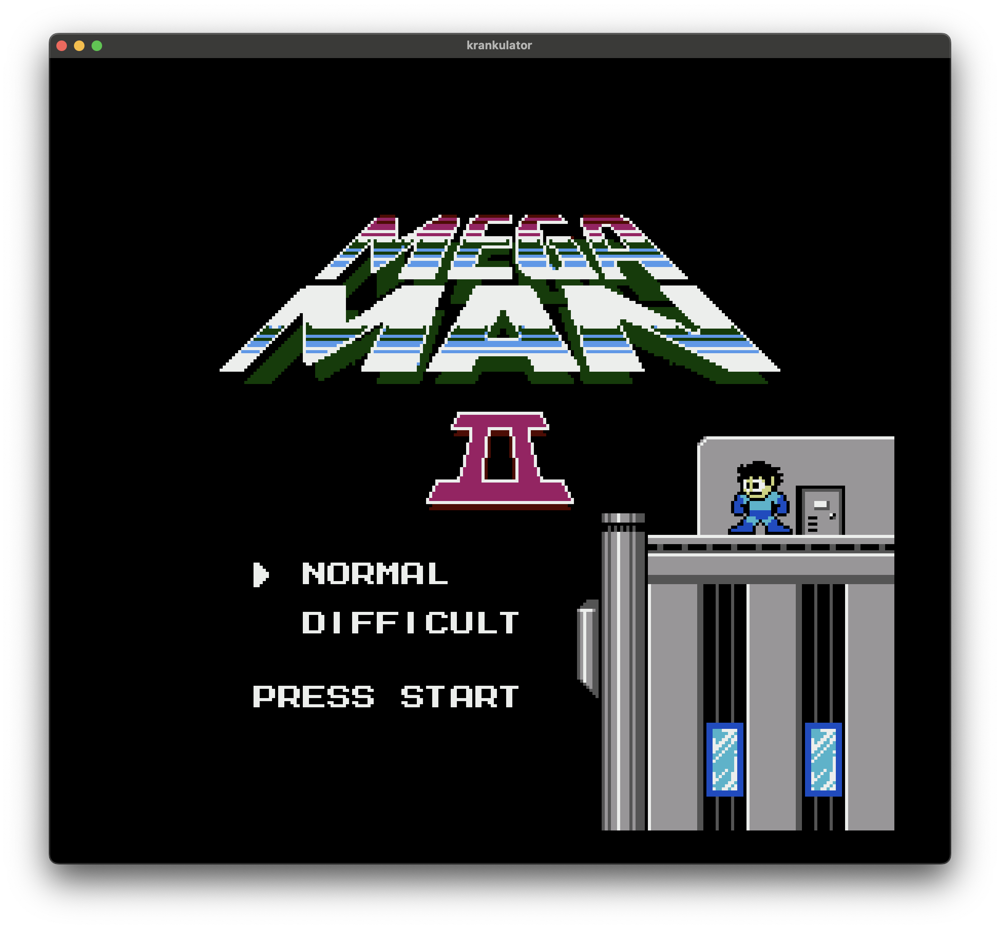
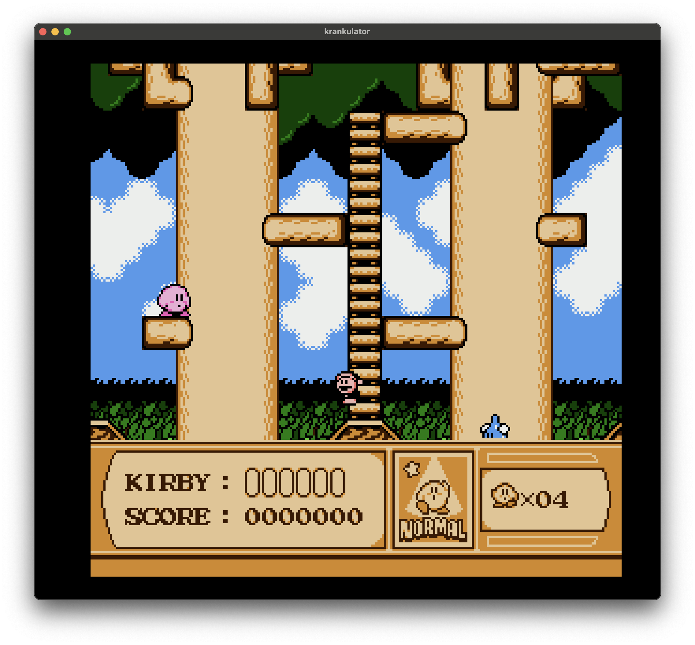
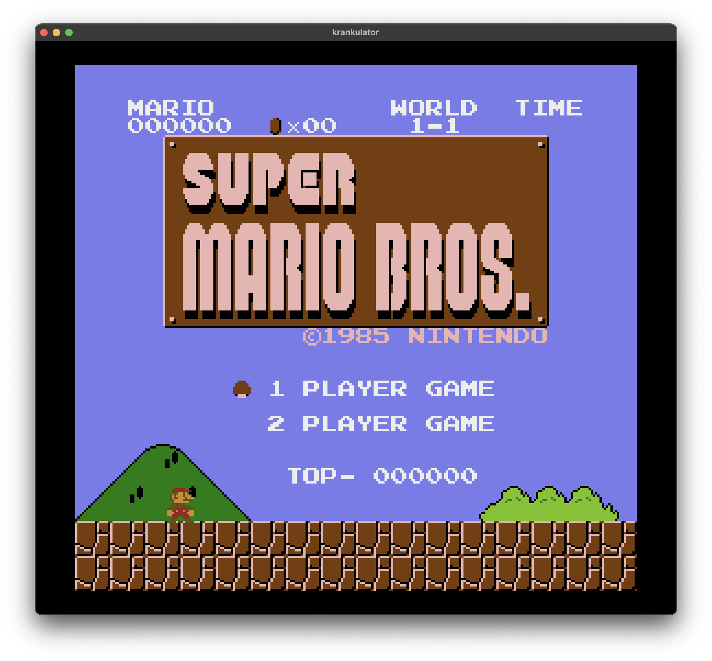
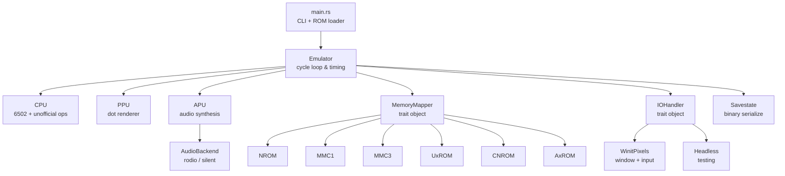

# krankulator

A cycle-stepped NES emulator written in Rust.

Started as a learning-Rust project — a bare 6502 emulator iterating against the [Klaus2m5](https://github.com/Klaus2m5/6502_65C02_functional_tests) functional test suite. NES support grew from there: naive VBlank rendering and input, validated against Kevin Horton's [nestest](http://www.qmtpro.com/~nes/misc/) log; then mapper support for real cartridges; then APU audio and cycle-accurate PPU rendering in the AI-assisted era.





## Features

- **MOS 6502 CPU** — all official opcodes plus common unofficial ones (LAX, SAX, DCP, ISB, SLO, SRE, RLA, RRA)
- **PPU** — per-dot cycle-accurate rendering (active migration from VBlank-based), sprite evaluation, sprite 0 hit, even/odd frame timing
- **APU** — pulse, triangle, noise, and DMC channels with IIR high-pass/low-pass filter chain at 44.1 kHz
- **Mappers** — NROM (0), MMC1 (1), UxROM (2), CNROM (3), MMC3 (4), AxROM (7)
- **Battery-backed SRAM** — persistent `.sav` files for MMC1/MMC3 cartridges
- **Savestates** — 4 slots per game, custom binary format with full state serialization (CPU, PPU, APU including audio filter state, memory, mappers, controllers)
- **Audio output** via [rodio](https://github.com/RustAudio/rodio)
- **Windowed rendering** via [winit](https://github.com/rust-windowing/winit) + [pixels](https://github.com/parasyte/pixels)
- **Headless mode** for testing and CI

## Architecture



The emulator runs a tight cycle loop: each iteration executes one CPU cycle, then steps
the PPU three dots (3:1 PPU-to-CPU ratio), then cycles the APU. Memory mappers are trait
objects — each cartridge type implements its own bank switching, mirroring, and IRQ logic
(e.g. MMC3 scanline counter). The IO layer is also a trait, allowing windowed or headless
operation with the same emulation core.

## Building and running

```bash
cargo build --release
cargo run --release -- path/to/game.nes
```

### CLI options

```
cargo run -- [OPTIONS] <INPUT>

OPTIONS:
    --headless           Run without graphics
    --debug              Enable debugger
    --verbose / --quiet  Control log output
    -b, --breakpoint     Add CPU breakpoint (e.g. 0xC000)
    -l, --loader         Loader type: nes (default), ascii, bin
    --codeaddr           Code start address for bin/ascii loaders
```

### Controls

| Key | Action |
|-----|--------|
| Arrow keys | D-pad |
| Z | A button |
| X | B button |
| C | Start |
| V | Select |
| S | Save state |
| A | Load state |
| Q | Cycle save slot (0-3) |
| R | Reset |
| M | Mute/unmute log |
| 1-5 | Toggle individual APU channels |
| 0 | Master mute |
| Esc | Quit |

## Testing

Tests cover CPU instructions, PPU behavior, APU channels, memory mappers, and savestate
round-trips. Integration tests run actual NES test ROMs to validate accuracy:

```bash
cargo test              # run all tests
cargo test -- --ignored # run slow/WIP tests too
```

### Test ROM suites

| Suite | Tests | Status |
|-------|-------|--------|
| [Klaus2m5 6502 functional](https://github.com/Klaus2m5/6502_65C02_functional_tests) | Full instruction + addressing mode coverage | Pass |
| [nestest](http://www.qmtpro.com/~nes/misc/) | CPU instruction correctness (official + unofficial) | Pass |
| [Blargg CPU](https://github.com/christopherpow/nes-test-roms) | `official_only` — all official opcodes | Pass |
| Blargg PPU | VBlank basics/set/clear time, NMI control/timing/on/off, VBL suppression, even/odd frames/timing | Pass |
| Blargg APU | Length counters, length table, IRQ flag | Pass |
| Blargg APU (strict) | Jitter, len timing, IRQ flag timing, DMC basics, DMC rates | WIP |
| Blargg instruction timing | Cycle-accurate instruction timing | Pass |
| CPU interrupts | NMI and BRK interaction | Pass |
| PPU OAM | OAM read, OAM stress | Pass |
| CPU registers/RAM | Registers after reset, RAM after reset | Pass |
| VRAM access | VRAM read/write validation | Pass |

## Platform support

Built on cross-platform crates (winit, pixels, rodio) — runs on macOS, Linux, and
Windows. Tested primarily on macOS.

## Resources

- [nesdev wiki](https://www.nesdev.org/wiki/) — the authoritative NES hardware reference
- [6502 instruction set](https://www.masswerk.at/6502/6502_instruction_set.html)
- [6502 addressing modes](https://slark.me/c64-downloads/6502-addressing-modes.pdf)
- [Klaus2m5 functional tests](https://github.com/Klaus2m5/6502_65C02_functional_tests)
- [nestest](http://www.qmtpro.com/~nes/misc/) — Kevin Horton's CPU test ROM
- [NES rendering overview](https://austinmorlan.com/posts/nes_rendering_overview/)
- [nes-test-roms](https://github.com/christopherpow/nes-test-roms) — collection of NES test ROMs (Blargg et al.)
